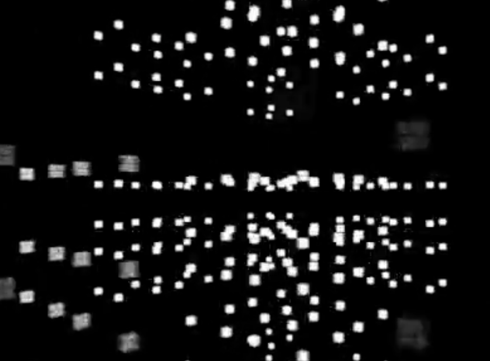
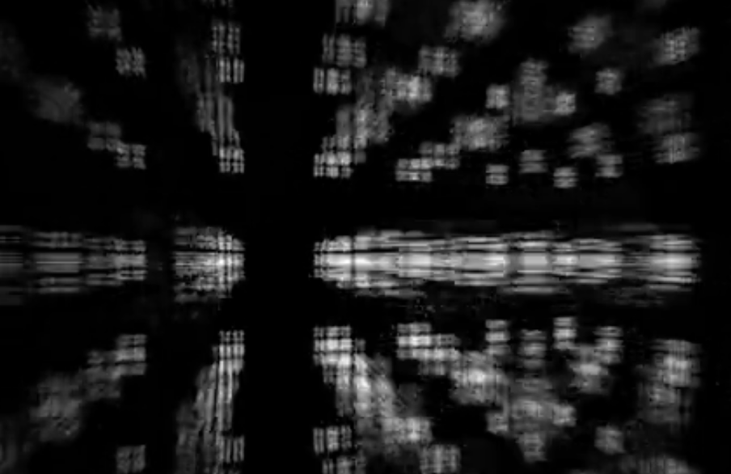
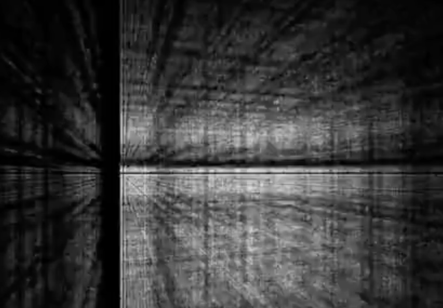

#Final Project: Interactive Partical Cube

This project is an interactive paritcal cube that can be interacted with sound/music. I connect openframeworks with physical computing, in this project, the accelerometer sensor. My intention is designing this for DJs when they step their foot based on beats, visuals will show on screen. Every time the accelerometer detects a y-axis move, it will pass the data to openframeworks to call the visual function to release more particles. 

Video demo link: https://vimeo.com/147495879

Screenshots: 

